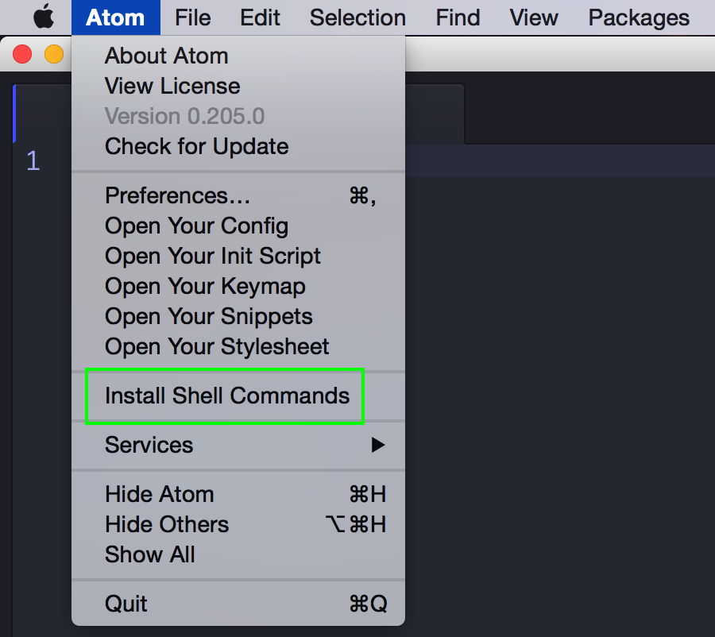

## Welcome to Bootcamp Prep!

We'll hit the ground running from day 1. If you don't want to be behind, please:
+ Read our [course introduction][course_intro].
+ Install [Node.js][node]
  + Download the current stable version for your operating system. The installation is very user-friendly. If you run into any problems, email us describing it and plan on coming in about 15 minutes early on the first day.
+ Install [Atom][atom]. It's going to be our text editor of choice during this course.
  + Once you have Atom installed, open it up and install its shell commands. (Atom > Install Shell Commands)

   

  + If you have trouble downloading and using Atom, please install [Sublime][sublime]. It'll periodically ask you to purchase a license. You can ignore that and continue using it for free.
+ Complete exercises 1 to 9 of  [Codecademy's Learn the Command Line][codecademy_cli] course.
+ Read [this][cli] about navigating your command line and prepare any questions you may have.
+ If you have no programming experience, do the [logical reasoning exercises][logical_reason].
+ Watch the first [lecture video (w1d1)][vid]
   + Write down everything you don't understand, so you can ask your teacher about it during lecture.
+ Read through [Week 1 Day 1 lecture notes][notes]
+ Do the [first two recitations:][recitation]
  + "Introduction To Recitation" and "Primitive Data"

[course_intro]:./programming_intro.md
[node]:https://nodejs.org/en/
[atom]:https://atom.io/
[sublime]:https://www.sublimetext.com/
[codecademy_cli]:https://www.codecademy.com/learn/learn-the-command-line
[cli]:./cli.md
[logical_reason]:../logical_reasoning_prep
[vid]:./lecture_videos.md
[notes]:../w1/d1/lecture_notes.md
[recitation]:../recitations
