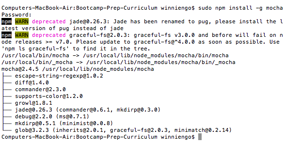

## Install Mocha

We will be using [mocha](https://www.npmjs.com/package/mocha) as our testing framework in this course. To install it:

#### MAC's
  + Open Terminal
  + Enter this command: `sudo npm install -g mocha`
  + Enter your password
  + You should see something like this upon a successful installation:
  
  + To test your installation, run the command: `mocha --version`. If it returns a version number, you've successfully installed mocha otherwise, let your instructor know.

#### PC's
  + Open Command Prompt
  + Enter this command: `npm install -g mocha`
  + To test your installation, run the command: `mocha --version`. If it returns a version number, you've successfully installed mocha otherwise let your instructor know.
