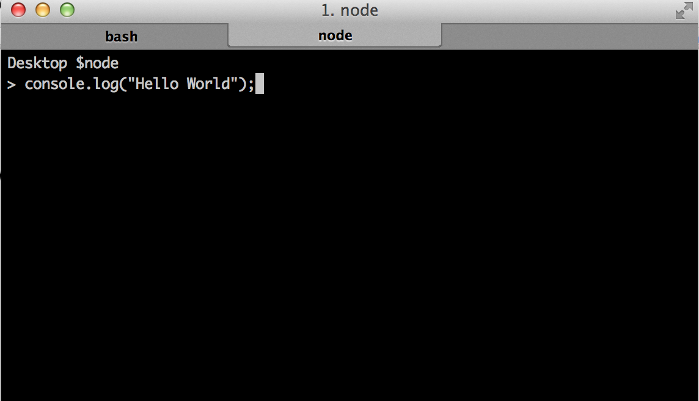

# Lecture Notes 1

## JavaScript Environment

JavaScript runs in 2 main environments: the browser and Node. Using the browser involves more than just understanding JavaScript, but also HTML, CSS, and familiarity with the browser environment. Running our code in the Node environment will allow us to focus purely on learning JavaScript.

So what is Node exactly? The [website](https://nodejs.org/en/) has a pretty good description. But the gist is that it is a way of running JavaScript outside of the browser environment.

Go to the website and download Node if you haven't already. After you've downloaded it, open your Terminal/Command Prompt and type:



**NB**: Macs: Terminal is an application on your computer so you'd access it the same way you would other applications (e.g. Chrome, App Store, Calendar, etc.). You can find it either via the Applications folder using Finder or via Spotlight Search (the magnifying glass in the upper-left corner of your screen)  and searching for Terminal. PCS: Similarly, Command Prompt is an application which you can access and use.

If it prints `Hello World`, then congratulations. Time to learn JavaScript.

## JavaScript Data Types

Before we start manipulating data, we first have to know what kinds of data we can manipulate. JavaScript provides 5 primitive data types for us:

* Numbers
* String (text)
* Boolean
* Undefined
* Null

We can group primitive data into composite forms, but that's another day.

## NaN

`NaN` stands for "not a number". This is the result of any illegal numerical
operations. Type the below in your console:

```
> 20 * "happy"
NaN
```

## Falsey vs Truthy

Zeros, empty strings, `undefined`, `null`, and `NaN` are all considered
falsey values.

Everything else is true

## Variables
**Variables** are used to store information to be referenced and manipulated in a computer program. They also provide a way of labeling data with a descriptive name, so our programs can be understood more clearly by the reader and ourselves. It is helpful to think of variables as containers that hold information. Their sole purpose is to label and store data in computer memory. This data can then be used and even changed throughout your program.

### Declaring Variables

In JavaScript, in order to use a variable, we must *declare* it. Variable
**declaration** is the act of introducing the variable to the environment. When we declare
a variable, we will often *initialize* it to a value.

To declare a variable, use the `var` keyword, followed by a space and then the name of the variable.

```javascript
var myVar;
```

### Variable Assignment and Initialization
To initialize a variable to a value, simply assign the variable to a value when you
declare it using the *assignment operator*, `=`.

*NB*: In programming, a equal sign is used to assign values to variables, not to indicate equality like it is in math.

Let's initialize our variable `myVar` to the number `5`:

```javascript
var myVar = 5;
```

Now it is time to experiment. Open your Terminal/Command Prompt and type the following:

```javascript
$ node
> var myVar;
```

Since we have not declared myVar, you'll see an error message.

```javascript
> var myVar;
undefined

> myVar; // We can use myVar without error because we declared it.
undefined // Evaluates to undefined because we did not initialize myVar to any value.

> myVar = 5; // Assigning the value 5 to the variable myVar
5

> myVar + 2; // What will this evaluate to?
```

Notice that when I declare or initialize a variable, node prints out something
underneath it. That is the return value. Everything is javascript has a return
value, even declaration and initialization. `undefined` is the default return
value.

Let's look at another example:
```javascript
> var myOtherVar = "Anthony";
"Anthony"

> "Hello " + myOtherVar; // What will this evaluate to?
```

## Useful Methods

### Mathematical Operators

* `+`
* `-`
* `*`
* `/`
* `%` (modulus)

### Comparison Operators

* `>`
* `<`
* `>=`
* `<=`
* `===`
* `!==`

### Logical Operators

* `&&`
* `||`
* `!`

### String Methods

* `String.prototype.toLowerCase`
* `String.prototype.toUpperCase`
* `String.prototype.indexOf`
* `+`

*We will talk about this `prototype` later, but for now just now that a class's
methods are defined on it*

## Creating a Function

We are able to create our own custom functions too. Let's say we wanted to
create a function called `addThree`. The specification of this function
describes it as taking as an input any three numbers and returning as the output
 the sum of those numbers. For example:

```
> addThree(1, 1, 1);
3
> addThree(0, 1, -15);
-14
> addThree(5, 100, 30);
135
```

The syntax for defining a function is as follows:

```javascript
function nameOfFunction(param1, param2, param3, paramN) {
  //function body...
}

OR

var nameOfFunction = function(param1, param2, param3, paramN) {
  //function body...
}
```

Let's see how we would define our `addThree` function.

```javascript
function addThree(number1, number2, number3) {
  return number1 + number2 + number3;
}
```

When you call a function, the order of your arguments are very important. They
must correspond to the order of the parameters in the function definition.

The `return` keyword is used to actually return a value from the function. If a
function doesn't return anything explicitly, then it implicitly returns `undefined`.
Another important thing to remember is that `return` hops out of a function. For example:

```javascript
function myFunc() {
  return "Hello world!!!";
  return "This line will never be hit".
}

myFunc() === "Hello world!!!"
```

You may be wondering, why would we ever put two `return` values in a single
function. We'll find out tomorrow when we talk about conditionals.

## Syntax

### ;

Every statement needs a semi-colon at the end. This is like a period for the
computer. Although you may find that your programs will sometimes work without
them **leaving out semi-colons is a very bad practice because it makes your code
more error prone**.

### ( )

Parentheses are used when defining functions and calling functions. We will talk
more about defining functions below. When calling a function, if you forget to add
the parentheses, you'll see that it evaluates to `[Function]` - that is how node
represents function object. To actually run the function, you must add parentheses.
For an example, see below:

```
> "Happy".toUpperCase
[Function]

> "Happy".toUpperCase()
"HAPPY"
```

### { }

Curly brackets are used in several programming constructs - function definitions,
loops, if-statements. They wrap around the block of code that belongs to that
construct.

Curly brackets also define `objects`, but more on that later :)
